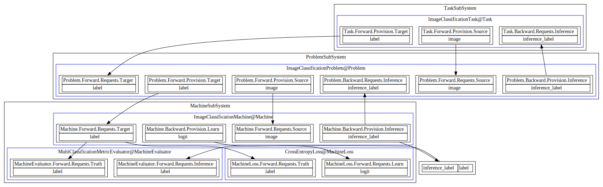

# Tutorial for TripMaster

This tutorial shows how to build a full life-time simple standalone application using tripmaster platform.


## Prepare the Task 

When you start an application, the first thing is to express your task:

* What kind of data it takes?
* What data should it produces?
* How the performance is evaluated?

The information is modeled by the `Task` component:

```python
from tripmaster.core.components.task import TMTask
from tripmaster.core.concepts.contract import TMContractChannel


class ImageClassificationTask(TMTask):
    ForwardProvisionSchema = {
        TMContractChannel.Source: {"image": object},
        TMContractChannel.Target: {"label": int}
    }
    BackwardRequestSchema = {
        TMContractChannel.Inference: {"inference_label": int}
    }
    Evaluator = None
```
Above code defines the task component of the app. Each component in TripMaster is a contracted bi-directional data processor.
It processes data in two directions: `forward` and `backward`. The `forward` direction is to model the data and feed to the 
machine, while the `backward` direction is to reconstruct the machine prediction from machine level (batch tensors) to
task level. 

For the `Task` component, the forward direction is to provide data (and not require any data). We use 
```python
ForwardProvisionSchema = {
        TMContractChannel.Source: {"image": object},
        TMContractChannel.Target: {"label": int}
    }
```
to define the data provided by the task to following components in the `forward` direction. 
The backward direction is to receive the reconstructed data generated from the machine. In this app, we require machine 
will predict the `inference_label` of an input image, so we announce this by:
```python 
BackwardRequestSchema = {
        TMContractChannel.Inference: {"inference_label": int}
    }
```
This kind of explicit declaration of data contract may cost some energy, but it greatly helps for validating the data-stream and for
better understanding of the application. The details about the contract and channel system can be found in [Data Pipeline](./pipeline.md).

There is a `Evaluator` filed in `Task` component. It defines the `task-level` evaluator to evaluate the machine prediction
performance. That is, it will compare the data in `TMContractChannel.Target` and `TMContractChannel.Inference`, 
then output the metric. `Problem` and `Machine` components also have their own evaluator setting to perform the 
`problem-level` and `machine-level` performance. Here, the `Evaluator` field is set to `None` because for this app, there 
is no differnce between the evaluators in these three levels, so we just keep the `machine-level` evaluator, which is defined 

## Consider the Mathematical Modeling and Prepare the Problem 

After define the task, we must consider the mathematical modeling of the task:

* What kind of mathematical model is suitable for modeling the task?
* What abstract data structure is suitable for implement the modeling ?
* How the performance of the modeling is evaluated?

The information is modeled by the `Problem` component. For this app, the image classification task
can be obviously modeled by a mapping from a 2-d matrix to an integer label. 
So we define the problem component as follows:

```python
import numpy as np
from tripmaster.core.components.problem import TMProblem
from tripmaster.core.concepts.contract import TMContractChannel


class TensorClassificationProblem(TMProblem):
    ForwardProvisionSchema = {
        TMContractChannel.Source: {"tensor": np.ndarray},
        TMContractChannel.Target: {"label": int}
    }
    BackwardRequestSchema = {
        TMContractChannel.Inference: {"inference_label": int}
    }
    Evaluator = None
```
Note that the schema definitions are almost equal to that in the `Task` component, except the type of `image` is 
`np.ndarray` rather than `object`. This is because that in the `Task` level, we may have various types of input data, 
for example, image path or Image object. But in the `Problem` component, we require the image be converted into `np.ndarray`. 
If the input data for task do not meet the requirements of problem, a task-problem modeler is needed. In this app, we load 
the data directly in the form of `np.ndarray`, so the modeler is not needed.

## Solve the Problem by Machine

After define the problem, we begin to write the solution of the problem -- the `Machine` component. The component considers
following issues:

* What kind of machine is suitable for solving the problem?
* What kind of loss should be used to learn the machine?
* How the performance of the machine is evaluated?

For this app, we define the machine as follows:

```python
from tripmaster.core.components.machine.machine import TMMachine
from tripmaster.core.concepts.contract import TMContractChannel
from tripmaster.core.components.evaluator import TMMetricEvaluator
from tripmaster.core.components.loss import TMFunctionalLoss
import paddle
import paddle.nn as nn
import math
class ClassificationEvaluator(TMMetricEvaluator):

    Metrics = {"label": [paddle.metric.Precision(), paddle.metric.Recall()]}

class ClassificationLoss(TMFunctionalLoss):

    Func = paddle.nn.functional.cross_entropy
    LearnedFields = ["logit"]
    TruthFields = ["label"]


class Tensor2DClassificationMachine(TMMachine):
    ForwardRequestSchema = {
        TMContractChannel.Source: {"tensor": paddle.Tensor},
        TMContractChannel.Target: {"label": int}
    }
    BackwardProvisionSchema = {
        TMContractChannel.Learn: {"logit": paddle.Tensor},
        TMContractChannel.Inference: {"inference_label": int}
    }

    Loss = ClassificationLoss
    Evaluator = ClassificationEvaluator
    EvaluatorInferenceContract = {"inference_label": "label"}

    def __init__(self, hyper_params, states=None):
        super().__init__(hyper_params, states=states)

        self.conv1 = nn.Conv2d(1, self.arch_params.channel1, self.arch_params.conv_kernel, 1)
        conv1_out_h = self.arch_params.image_size[0] - (self.arch_params.conv_kernel - 1)
        conv1_out_w = self.arch_params.image_size[1] - (self.arch_params.conv_kernel - 1)

        self.conv2 = nn.Conv2d(self.arch_params.channel1, self.arch_params.channel2,
                               self.arch_params.conv_kernel, 1)
        conv2_out_h = conv1_out_h - (self.arch_params.conv_kernel - 1)
        conv2_out_w = conv1_out_w - (self.arch_params.conv_kernel - 1)

        self.pool = nn.MaxPool2d(self.arch_params.pool_kernel)

        pool_out_h = math.floor((conv2_out_h - (self.arch_params.pool_kernel - 1)) / self.arch_params.pool_kernel + 1)
        pool_out_w = math.floor((conv2_out_w - (self.arch_params.pool_kernel - 1)) / self.arch_params.pool_kernel + 1)

        self.dropout1 = nn.Dropout(self.arch_params.dropout1)
        self.dropout2 = nn.Dropout(self.arch_params.dropout2)

        self.fc1 = nn.Linear(self.arch_params.channel2 * pool_out_h * pool_out_w, self.arch_params.ff_dim)
        self.fc2 = nn.Linear(self.arch_params.ff_dim, self.arch_params.class_num)

        if states:
            self.load_states(states)

    def forward(self, inputs, scenario=None):

        x = inputs["image"]
        x = self.conv1(x)
        x = paddle.relu(x)
        x = self.conv2(x)
        x = paddle.relu(x)
        x = self.pool(x)
        x = self.dropout1(x)
        x = paddle.flatten(x, 1)
        x = self.fc1(x)
        x = paddle.relu(x)
        x = self.dropout2(x)
        x = self.fc2(x)

        results = dict()
        if scenario in {TMScenario.Learning, TMScenario.Evaluation}:
            results["logit"] = x
        if scenario in {TMScenario.Evaluation, TMScenario.Inference}:
            results["inference_label"] = paddle.argmax(x, axis=-1)

        return results
```
The machine consumes the provisions of problem and provides `logits` for learning/evaluation and `inference_label`
for evaluation/inference. All the information is defined in the contract declarations of the machine component. 
The `Loss` field sets the loss component used in the machine for training, which uses the data in 
`TMContractChannel.Learn` and `TMContractChannel.Target` to compute the loss and provide to the optimizer. 

## Select the Operator 

After the machine is built, the next thing is to select an operator for the machine. `TripMaster` introduces the 
`Operator` component, which is responsible to operate the machine and get the result. There are two kinds of operator in
`TripMaster`: `Learner` is to train the machine, while `Inferencer` is to produce the inferenced data stream. 

The `Learner` is responsible for the following issues:
* Select suitable optimizer and learning-rate scheduler for the machine;
* Select suitable model-selection strategy to select the best machine;
* Batch the data stream for efficiency operation on GPU;
* Select suitable distributed training strategy;
* Run the training loop using above strategies and produce the final machine.

The `Inferencer` is responsible for the following issues:
* Batch the data stream for efficiency operation on GPU;
* Select suitable distributed inferencing strategy;
* Run the inference procedure of machine on the input stream to produce the inferenced data stream.

Although it seems that the operators involve so many strategies, these strategies are largely reusable and can be pre-defined. 
User can just select and combine them to form an operator for themselves. `TripMaster` provides a base class `TMLearner` 
for learning. We can implement our own leaner for mnist easily by setting the optimizer and lr scheduler as follows.

```python
from tripmaster.core.components.operator.supervise import TMSuperviseLearner


class MnistLearner(TMSuperviseLearner):
    Optimizer = paddle.optimizer.Adam
    LRScheduler = paddle.optimizer.lr.ExponentialDecay


```
`TripMaster` also provides a base class `TMInferencer` for inference, which can be directly used without 
implementing another class. Strategies except the optimizer and lr scheduler are internal implemented 
and can be configured by configuration files.


Furthermore, `TripMaster` also provide default 
operators for convinence: `TMDefaultLearner` and `TMDefaultInferencer`. In this simple app, we use the default 
operators.

## Define the System 

System assembles the components to work together. The `System` component considers following issues:

* Define all types of basic components in this system: `TaskType`, `ProblemType`, `MachineType`, and `OperatorType`;
* Define the connection components, including modelers and contracts, to connect these basic components;

We define following system for our simple app. In this case, we do not involve any connection component, since the schemas
of the basic components has already satisfied each other.

```python

from tripmaster.core.components.operator.supervise import TMSuperviseInferencer
from tripmaster.core.system.system import TMSystem


class ImageClassificationSystem(TMSuperviseSystem):
    TaskType = ImageClassificationTask
    Task2ProblemContract = {"image": "tensor"}
    ProblemType = TensorClassificationProblem
    MachineType = Tensor2DClassificationMachine


class ImageClassificationLearningSystem(ImageClassificationSystem):
    OperatorType = MnistLearner


class ImageClassificationInferenceSystem(ImageClassificationSystem):
    OperatorType = TMSuperviseInferencer

```

## Load the Data into DataStream

`TripMaster` provide the data stream concept concerning following issues:

* How to express the multiple-parts of complex data set;
* How to assign different roles ( learning, evaluation, or inference) for each part of the data set;

`TMDataStream` and `TMDataChannel` is proposed to address the issue. `TMDataChannel` is to express a part of 
the data set, containing a list/iterator of samples. `TMDataStream` contains a group of data channel, and assign the roles 
of each data channel. 

In our app, the data set is separated into three part `training`, `development`, and `testing`, with corresponding roles
`learning`, `evaluation`, `inference`. The data with role `learning` will be used for training; the data with role 
`evaluation` will be evaluated and the performance on those data will be output; the data with role 
`inference` is for inferencer operator to output the inferenced data stream. 

Our data stream is defined as follows:

```python
from tripmaster.core.concepts.data import TMDataStream, TMDataLevel
from tripmaster.utils.data import split_dataset
import random


class MnistDataStream(TMDataStream):

    def __init__(self, hyper_params, states=None):
        super().__init__(hyper_params, level=TMDataLevel.Task, states=states)

        if states is not None:
            self.load_states(states)
            return

        import paddle
        from paddle.vision.transforms import ToTensor
        train_dataset = [{"image": image, "label": label}
                         for image, label in paddle.vision.datasets.MNIST(mode='train', transform=ToTensor())]
        test_dataset = [{"image": image, "label": label}
                        for image, label in paddle.vision.datasets.MNIST(mode='test', transform=ToTensor())]

        random.shuffle(train_dataset)
        ratio = self.hyper_params.training_ratio
        train_dataset, dev_dataset = split_dataset(train_dataset, [ratio, 1 - ratio])

        self["train"] = train_dataset
        self["dev"] = dev_dataset
        self["test"] = test_dataset

        self.learn_channels = ['train']
        self.eval_channels = ['dev', 'test']
        self.inference_channels = ['test']

```

Note that `TripMaster` requires each sample be a dictionary, so above code convert `(image, label)` pairs into dictionary.

## Define the Application 

The application feed the input to the system, and then receive the output of the system. 

We define our learning application as follows:

```python


from tripmaster.core.app.standalone import TMStandaloneApp

from tripmaster.core.app.io import TMOfflineInputStream


class MnistInputStream(TMOfflineInputStream):
    DataStreamType = MnistDataStream


class MnistLearningApplication(TMStandaloneApp):
    InputStreamType = MnistInputStream
    SystemType = ImageClassificationLearningSystem

```

We define our inferencing application as follows:

```python 

from tripmaster.core.app.standalone import TMStandaloneApp
from tripmaster.core.app.io import TMOfflineOutputStream

class MnistInferenceApplication(TMStandaloneApp):
    InputStreamType = MnistInputStream
    OutputStreamType = TMOfflineOutputStream
    SystemType = ImageClassificationInferenceSystem

```

## Configure and Run the Application

To configure the system and application, we write following config file:

```yaml
io:
  input:
    task:
      training_ratio: 0.9
  output:
    serialize:
      save: True
      path: ${job.startup_path}/mnist.inference.pkl
launcher:
  type: local
  strategies:
    local:
job:
  ray_tune: false
  testing: False
  test:
    sample_num: 16
    epoch_num: 3
  batching:
    type: fixed_size
    strategies:
      fixed_size:
        batch_size: 16
        drop_last: False
  distributed: "no"
  dataloader:
    worker_num: 0 # load data using multi-process
    pin_memory: false
    timeout: 0
    resource_allocation_range: 10000
    drop_last: False
  resource:
    computing:
      cpu_per_trial: 4
      cpus: 4
      gpu_per_trial: 0
      gpus: 0
    memory:
      inferencing_memory_limit: 60000
      learning_memory_limit: 25000
  metric_logging:
    type: tableprint
    strategies:
      tableprint: { }
system:
  serialize:
    save: True
    path: ${job.startup_path}/mnist.system.pkl
    load: False
  task:
    evaluator:
  problem:
    evaluator:
  machine:
    arch:
      image_size: [28, 28]
      channel1: 32
      channel2: 64
      conv_kernel: 3
      pool_kernel: 2
      dropout1: 0.25
      dropout2: 0.5
      ff_dim: 128
      class_num: 10
  learner:
    optimizer:
      strategy:
        epochs: 3
      algorithm:
        lr: 1e-3
      lr_scheduler:
        gamma: 0.8
      gradient_clip_val: 1
    modelselector:
      stage: "machine"
      channel: "dev"
      metric: "label.precision"
      better: "max"
      save_prefix: "best"
    evaluator_trigger:
      trigger_at_begin: False
      evaluate_only: False
      interval: 1
      epoch_interval: -1
  
```

We write the app launch code as follows:

```python

import click

@click.command(context_settings=dict(ignore_unknown_options=True, allow_extra_args=True))
@click.argument("operator", type=click.Choice(("learning", "inference")),
                default="learning")
def run(operator):
    # deterministic(seed=0)
    if operator == "learning":
        MnistLearningApplication.launch()
    else: # operator == "inference":
        MnistInferenceApplication.launch()


if __name__ == "__main__":
    run()

```

We run the learning app with following command:
```zsh
python mnist.py learning --conf mnist_config.yaml --experiment learning_mnist
```
and the inference app with following command 
```zsh 
python mnist.py inference --conf mnist_config.yaml --experiment inference_mnist
```

Furthermore, we can visualize the structure of the system by:
```zsh
python mnist.py learning --contract
```
It will produce the following diagram:


## Resource 

* [mnist.py](../examples/mnist/mnist.py)
* [mnist_config.yaml](../examples/mnist/mnist_config.yaml)